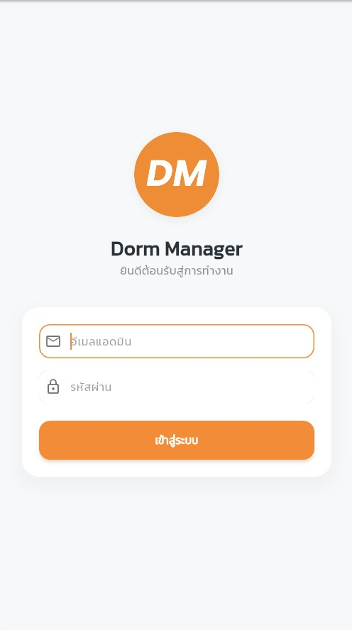
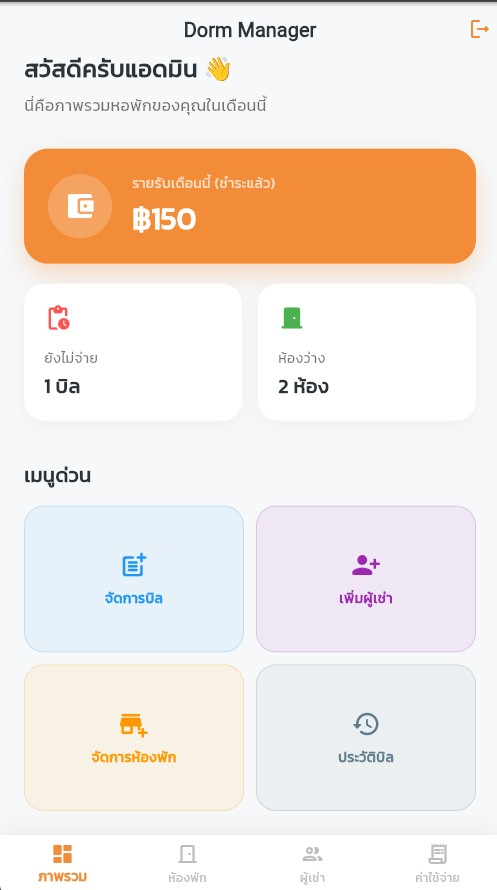
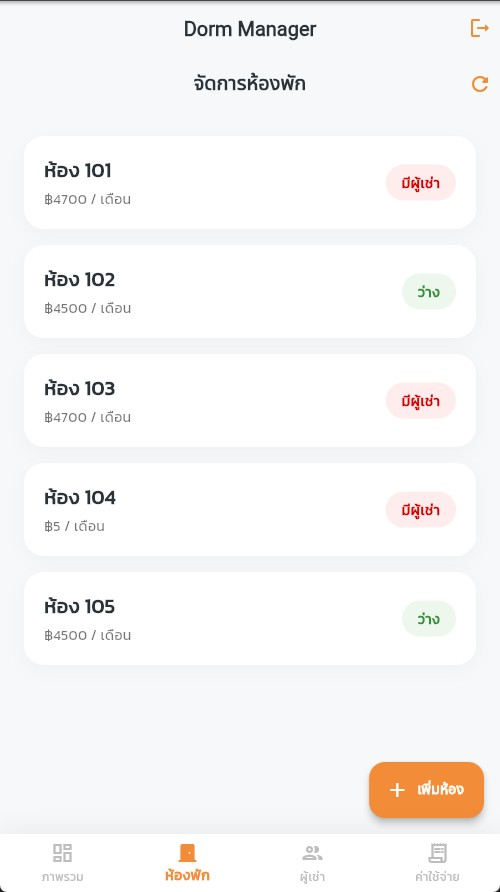
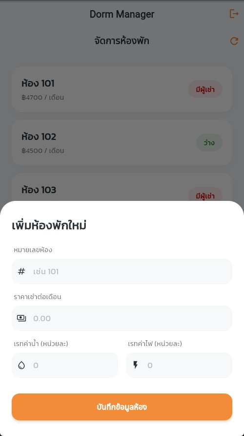
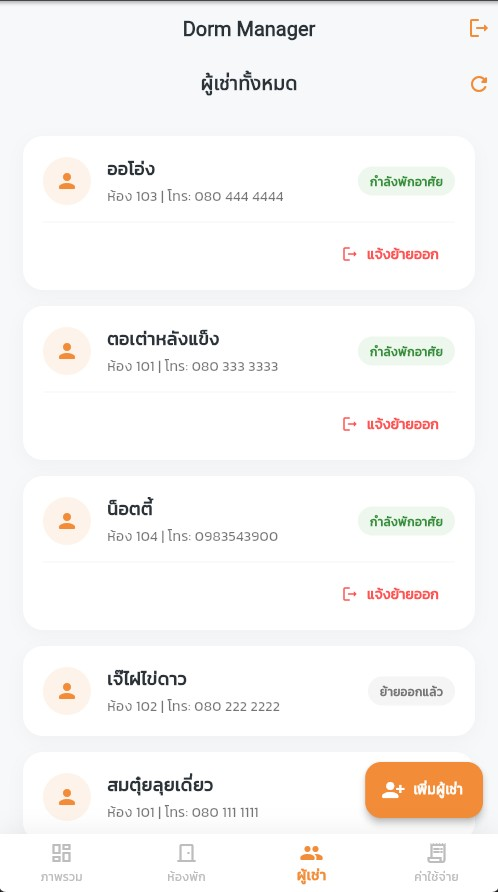
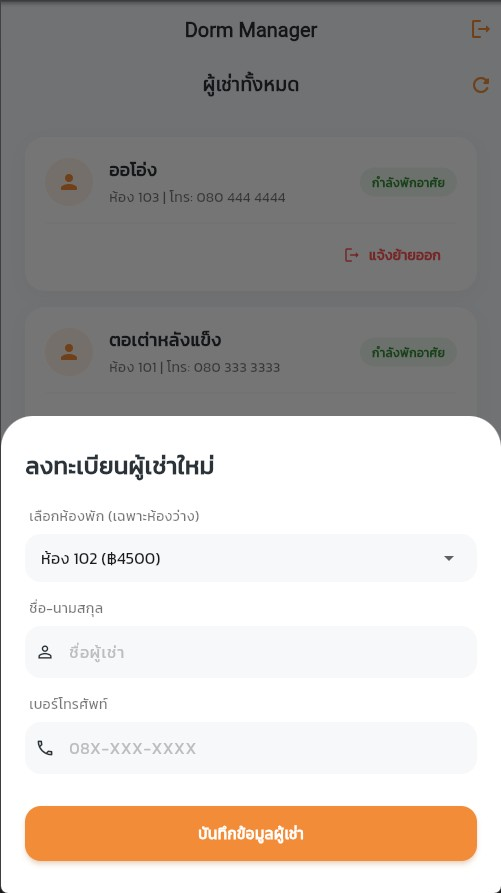
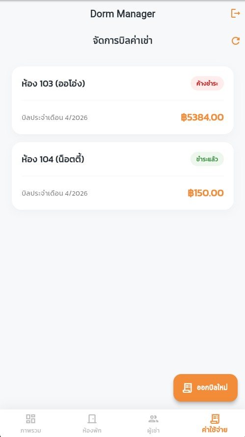
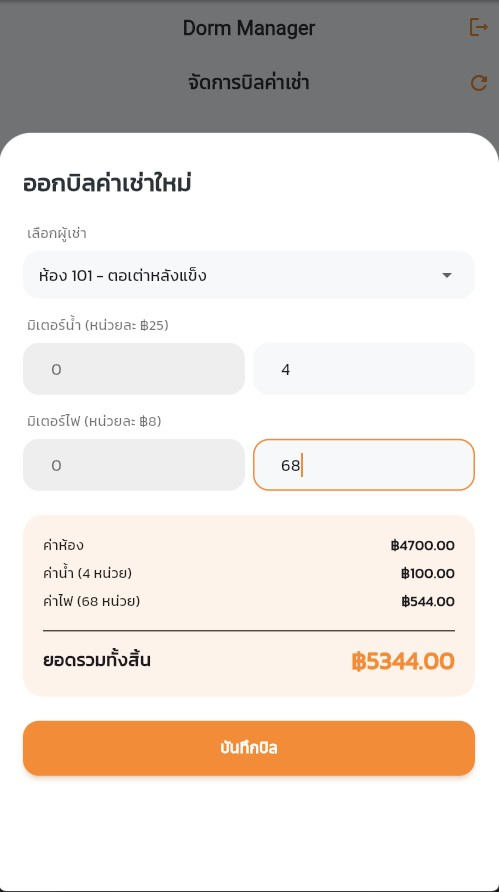
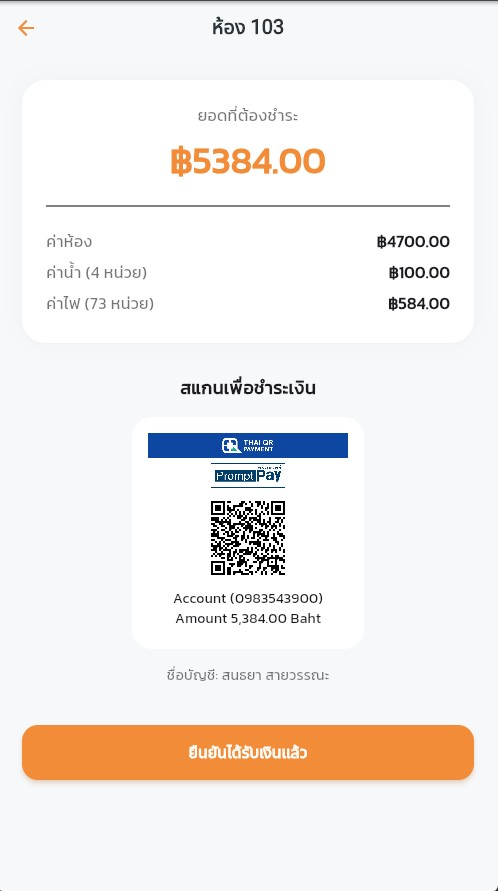
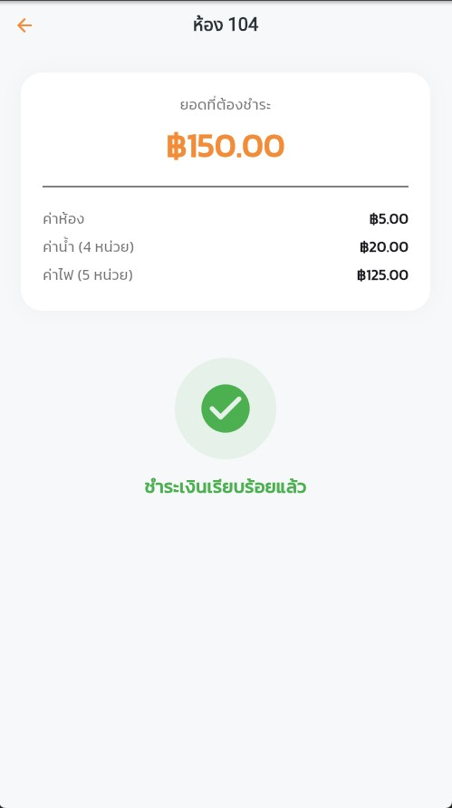

บทคัดย่อ (Abstract)
=
Dorm Manager คือแอปพลิเคชันจัดการหอพักอัจฉริยะที่พัฒนาด้วย Flutter และ Supabase โดยมีวัตถุประสงค์เพื่อเปลี่ยนผ่านการบริหารจัดการหอพักจากระบบเอกสารดั้งเดิมสู่ระบบดิจิทัล เพื่อลดความผิดพลาดในการคำนวณและเพิ่มความสะดวกในการจัดเก็บข้อมูลแอปพลิเคชันนี้เน้นการทำงานที่รวดเร็ว (Real-time) และการออกแบบหน้าจอที่ใช้งานง่าย เพื่อให้ผู้ดูแลหอพักสามารถบริหารจัดการห้องพัก ผู้เช่า และยอดค้างชำระได้อย่างมีประสิทธิภาพจากทุกที่ทุกเวลา

////////////////////////////////////////////

ฟีเจอร์หลักของแอปพลิเคชัน (Key Features)
=
1.Splash Screen: หน้าจอต้อนรับพร้อมระบบตรวจสอบสถานะการเข้าสู่ระบบอัตโนมัติ (Auto-Login) ช่วยให้แอดมินเข้าถึงระบบได้อย่างรวดเร็วโดยไม่ต้องกรอกรหัสผ่านซ้ำหากเคยล็อกอินไว้แล้ว

2.Login System: ระบบรักษาความปลอดภัยสำหรับผู้ดูแลหอพัก เชื่อมต่อกับระบบ Authentication ของ Supabase เพื่อป้องกันการเข้าถึงข้อมูลโดยไม่ได้รับอนุญาต

3.Dashboard: หน้าสรุปภาพรวมการทำงาน แสดงข้อมูลสำคัญแบบ Real-time เช่น ยอดรายรับประจำเดือน จำนวนห้องว่าง และจำนวนบิลที่ยังค้างชำระ ช่วยให้ตัดสินใจบริหารจัดการได้ทันที

4.Room Management: ระบบจัดการสถานะห้องพัก แสดงผลแยกประเภทห้องว่างและห้องที่มีผู้เช่า ช่วยให้แอดมินวางแผนการรับผู้เช่าใหม่ได้อย่างแม่นยำ

5.Tenant Management: ระบบจัดเก็บข้อมูลผู้เช่าอย่างเป็นระเบียบ รองรับการลงทะเบียนผู้เช่าใหม่และการทำเรื่องย้ายออก (Check-out) พร้อมสรุปยอดค้างชำระก่อนคืนห้อง

6.Billing & Expenses: หัวใจสำคัญของแอปที่ช่วยคำนวณค่าน้ำ-ค่าไฟอัตโนมัติ พร้อมระบบสร้าง QR Code พร้อมเพย์ตามยอดจริง เพื่อให้แอดมินส่งให้ผู้เช่าสแกนจ่ายได้ทันที ลดขั้นตอนการแจ้งยอดแบบเดิม

////////////////////////////////////////////

**หน้าจอการทำงานของแอปพลิเคชัน (Screenshots)**
=
**1. หน้าต้อนรับและระบบเข้าสู่ระบบ (Splash & Login)**

**2. หน้าสรุปข้อมูลภาพรวม (Dashboard)**

**3. ระบบจัดการห้องพัก (Room Management)**

**4. ระบบจัดการผู้เช่า (Tenant Management)**

**5. ระบบจัดการบิลและค่าใช้จ่าย (Billing & Expenses)**

////////////////////////////////////////////

Backend Integration: Supabase
=
แอปพลิเคชันเลือกใช้ Supabase เป็นระบบหลังบ้านหลัก (Backend as a Service) เพื่อการจัดการข้อมูลแบบ Real-time และมีความปลอดภัยสูง โดยมีการใช้งานโมดูลหลักดังนี้:

Authentication: จัดการระบบเข้าสู่ระบบของแอดมินผ่านอีเมลและรหัสผ่าน โดยใช้ supabase.auth ในการตรวจสอบสิทธิ์และคงสถานะการล็อกอิน (Session Persistence) ทำให้สามารถทำระบบ Auto-login ในหน้า Splash Screen ได้

Database (PostgreSQL): ใช้เก็บข้อมูลโครงสร้างทั้งหมดของหอพัก ได้แก่ ข้อมูลห้องพัก (Rooms), ข้อมูลผู้เช่า (Tenants), และข้อมูลการออกบิลค่าใช้จ่าย (Bills)

Row Level Security (RLS): มีการตั้งค่านโยบายความปลอดภัย (Policies) เพื่อควบคุมการเข้าถึงข้อมูล โดยอนุญาตให้เฉพาะแอดมินที่มีสิทธิ์เท่านั้นที่สามารถอ่านหรือแก้ไขข้อมูลภายในฐานข้อมูลได้

Real-time Data: การเชื่อมต่อข้อมูลผ่าน supabase_flutter ทำให้การอัปเดตสถานะห้องพักหรือยอดรายรับบนหน้า Dashboard ทำได้รวดเร็วและแม่นยำ